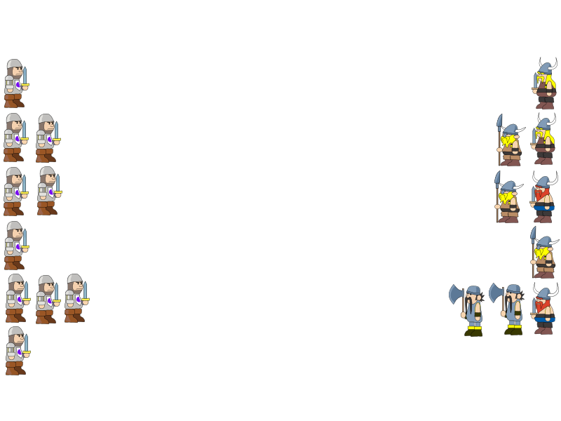
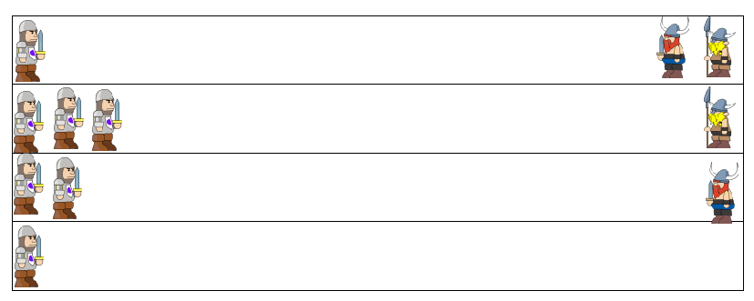
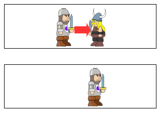
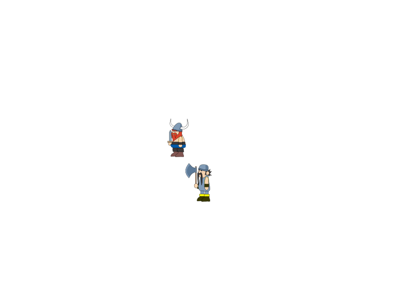

Batalla-campal
==============

Introducció
----------------------
L'objectiu del programa és representar la batalla entre dos exercits diferents formats per soldats que mataran i moriran xocant amb els altres soldats.

* Això és un exercici que he proposat als alumnes per aprendre Programació Orientada a Objectes
* El mòdul s'imparteix en Java
* L'única dependència és la llibreria de Java de l'ACM (http://cs.stanford.edu/people/eroberts/jtf/)

Es pot veure un exemple del programa en execució en un [vídeo de Youtube](http://youtu.be/hspq83vK7-Y)

Creació del programa
------------------------
Per crear el programa cal tenir *Java* instal·lat en el sistema així com una eina de construcció de projectes (*Maven* o *Gradle*)

### Construir el projecte amb Maven
El projecte de Maven està pensat per crear un paquet amb totes les dependències a dins.

    $ mvn package

El programa (amb extensió *.jar) estarà en el directori *target*

    $ cd target
    $ ls Batalla-0.0.1-SNAPSHOT.jar

### Construir el projecte amb Gradle
El projecte amb Gradle també està pensat per crear un jar amb totes les dependències. Per crear-lo només cal executar:

    $ gradle build

El programa (amb extensió *.jar) estarà en el directori *build/libs*

    $ cd build/libs
    $ ls Batalla-0.0.2-SNAPSHOT.jar

### Executar el programa
Per executar el programa només cal invocar-lo en la JVM:

    $ java -jar Batalla-0.0.2-SNAPSHOT.jar

En alguns sistemes (com Windows) n'hi ha prou amb fer doble clic sobre el programa. 

Formació inicial
--------------------------------
Al començament de la batalla cada exèrcit es posarà en files en un dels costats de la pantalla i es mourà en direcció a l'altre exèrcit. Per començar els exèrcits es dividiràn en 6 files en les que cada exèrcit hi posarà aleatòriament els seus soldats.

En el moment en que quedin menys de 6 soldats en un dels dos exèrcits les files es reduiran a tantes com soldats tingui l'exercit més petit.

Avançar
---------------------------
En cada passada tots els soldats d'un exèrcit aniran avançant un número aleatori de píxels. En cas en que un soldat caigui damunt de un enemic (el matarà) i desapareixerà de la pantalla.

En l'avenç hi ha restriccions:
* Quan es mata un enemic no es pot avançar més de la posició que ocupava aquest
* No es poden matar soldats amics. Els soldat del darrera mai podrà avançar el del davant.

Un cop ha avançat un exercit avançarà l'altre en les mateixes condicions
* Per evitar que cap dels dos exèrcits tingui avantatge abans de cada ronda es decidirà aleatòriament quin dels dos exèrcits es mou primer

Quan tots els soldats dels dos exèrcits arribin a l'altre costat es tornaran a posar en formació en l'altre costat i avançaran en sentit contrari.

Final del joc
----------------------
El joc acabarà quan un dels dos exèrcits es quedi sense soldats

